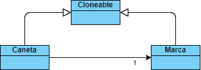

# Padrão Prototype

Instancear um objeto a partir de outro
como base para outro objeto.  
Criar um objeto default (com as propriedades preenchidas) e clona-lo, para criar novos.

> É necessário também clonar sub-objetos para *garantir que não apontem para o mesmo sub-objeto*

**Caso de uso**: Categorização de canetas, que possuem parametros e podem ser de diferentes marcas (que possuem código e lote).

